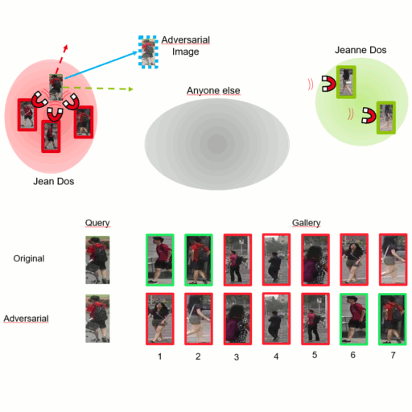

# Vulnerability of Person Re-Identification Models to Metric Adversarial Attacks

This repository contains the reference source code for the paper [Vulnerability of Person Re-Identification Models to Metric Adversarial Attacks](http://openaccess.thecvf.com/content_CVPRW_2020/papers/w47/Bouniot_Vulnerability_of_Person_Re-Identification_Models_to_Metric_Adversarial_Attacks_CVPRW_2020_paper.pdf) (CVPRW'20). For more information, please check out our paper, the [presentation](https://www.youtube.com/watch?v=X0YRPxzOMR0) or the [associated blogpost](https://qbouniot.github.io/article/2020/05/06/adv_reid.html). 

As classification attacks are not applicable to re-identification, we propose different possible attacks on metric learning models depending on the number and type of guides available. Two particularly effective attacks stand out. To defend against these attacks, we adapt the adversarial training protocol for metric learning. Let us guide you !



## Requirements

- python==3.6+
- torch==1.5.0
- torchvision==0.6.0
- advertorch==0.2.0

You can run `pip install -r requirements.txt` to install required packages or `conda env create -f environment.yml` to create a new environment with the required packages installed.

As we use *Market1501* and *DukeMTMC-reid* datasets for our experiments, you must download them beforehand. 

## Training

To train a Classification model on dataset *DukeMTMC-reid*, run:

```sh
python train.py \
         <dataset_folder> \
         --dataset 'duke' \
         --lr 0.00035 \
         -wd 5e-4 \
         -n 60 \
         -f <checkpoint_name> \
         -b 32 \
         --classif \
         --pretrained 
```

For a Triplet model on dataset *Market1501*, run:

```sh
python train.py \
        <dataset_folder> \
        --dataset 'market' \
        --lr 0.0003 \
        -wd 0 \
        -n 100 \
        -f <checkpoint_name> \
        -b 72 \
        -ni 4 \
        -e 2048 \
        --pretrained \
        --triplet \
        --soft \
        --id_batch
```

By default, the checkpoints of the trained models are saved in the folder `./models/checkpoints/`.

## Evaluating

To evaluate a Classification model under attack, run:

```sh
python gen_adv.py \
        <checkpoints_folder> \
        <dataset_folder> \
        <checkpoint_name> \
        --dataset <dataset> \
        --classif \
        -a <attack> \
        --eps 5
```

## Defending

Before training a defended model, run `sort_dataset.py` to create a sorted dataset from which the guides are sampled.  
Then, to train a Classification model using GOAT with FNA, run:

```sh
python train.py \
        <dataset_folder> \
        --dataset <dataset> \
        --lr 0.00035 \
        -wd 5e-4 \
        -n 60 \
        -f <checkpoint_name> \
        -b 32 \
        --classif \
        --pretrained \
        --adv \
        --push \
        --pull
```

# License

This repository is released under the [CeCILL](LICENSE.txt) license, a free software license
adapted to both international and French legal matters that is fully compatible
with the FSF's GNU/GPL license.

# Citation

If you find this repository useful for your own work, please cite our paper:
```BibTeX
@InProceedings{Bouniot_2020_CVPR_Workshops,
  author = {Bouniot, Quentin and Audigier, Romaric and Loesch, Angélique},
  title = {Vulnerability of Person Re-Identification Models to Metric Adversarial Attacks},
  booktitle = {The IEEE/CVF Conference on Computer Vision and Pattern Recognition (CVPR) Workshops},
  month = {June},
  year = {2020}
}
```
